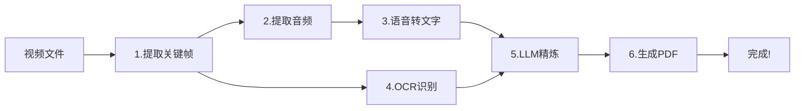

# 📹 视频分析器 Pro 版

> 教育讲课视频的一站式自动化处理工具 - 从视频到PDF,一键完成!

[](https://www.python.org/downloads/)
[](https://opensource.org/licenses/MIT)

---

## 🌟 特性

- ✅ **完全自动化** - 一个命令完成所有步骤
- 🔄 **智能断点续传** - 中断后可以继续,节省时间
- 🔍 **通义千问OCR** - 高准确度的中文识别
- 🎤 **Whisper语音识别** - 自动转录讲解内容
- 🤖 **LLM智能精炼** - 整合OCR和转录,纠错优化
- 📄 **精美PDF生成** - 图片+文字完美结合

---

## 🚀 5分钟快速开始

### 1. 安装依赖

```bash
pip3 install moviepy pillow opencv-python openai-whisper torch dashscope python-dotenv
```

### 2. 配置API密钥

创建 `.env` 文件:

```bash
# 必需 - 用于OCR识别
DASHSCOPE_API_KEY=sk-your-qwen-api-key

# 可选 - 用于文字精炼
LLM_API_KEY=your-openai-api-key
```

**获取API密钥:** [通义千问API](https://help.aliyun.com/zh/model-studio/get-api-key)

### 3. 运行处理

```bash
python3 video_analyzer_pro.py --video your_lecture.mp4
```

就这么简单! 🎉

---

## 📖 处理流程



### 详细步骤

| 步骤 | 功能 | 输出 |
|------|------|------|
| 1️⃣ | 提取关键帧 | 去重复的课件截图 |
| 2️⃣ | 提取音频 | MP3音频文件 |
| 3️⃣ | 语音转文字 | 带时间戳的转录文本 |
| 4️⃣ | OCR识别 | 课件上的文字内容 |
| 5️⃣ | LLM精炼 | 整合优化后的内容 |
| 6️⃣ | 生成PDF | 图片+文字完整文档 |

---

## 💡 使用示例

### 基础用法

```bash
# 一键处理
python3 video_analyzer_pro.py --video lecture.mp4
```

### 快速模式

```bash
# 更快的处理速度
python3 video_analyzer_pro.py \
  --video lecture.mp4 \
  --whisper-model tiny \
  --no-llm
```

### 高质量模式

```bash
# 最佳输出质量
python3 video_analyzer_pro.py \
  --video lecture.mp4 \
  --whisper-model medium \
  --ocr-model qwen-vl-max
```

### 批量处理

```bash
# 处理多个视频
for video in *.mp4; do
    python3 video_analyzer_pro.py --video "$video"
done
```

---

## 📁 输出结果

```
results/
├── extracted_frames/              # 提取的关键帧图片
│   ├── frame_0000_0.00s.jpg
│   ├── frame_0001_5.50s.jpg
│   └── ...
├── lecture.mp3                   # 提取的音频
├── lecture_transcript.txt        # 语音转录文本
├── lecture_ocr_qwen.txt         # OCR识别结果
├── lecture_refined.json         # LLM精炼结果
└── lecture_frames_pro.pdf       # 🎯 最终PDF文档
```

---

## ⚙️ 命令行参数

```bash
python3 video_analyzer_pro.py --help
```

### 主要参数

| 参数 | 说明 | 默认值 |
|------|------|--------|
| `--video` | 视频文件路径 (必需) | - |
| `--whisper-model` | Whisper模型 (tiny/base/small/medium/large) | base |
| `--ocr-model` | OCR模型 | qwen-vl-max |
| `--no-llm` | 跳过LLM精炼 | False |
| `--no-skip` | 强制重新处理 | False |

---

## 🎯 智能断点续传

脚本会自动检测已完成的步骤:

```bash
# 第一次运行(处理中断)
python3 video_analyzer_pro.py --video lecture.mp4
# Ctrl+C 中断

# 第二次运行(自动继续)
python3 video_analyzer_pro.py --video lecture.mp4
# ✓ 发现已提取的帧 (跳过)
# ✓ 发现已提取的音频 (跳过)
# ✓ 发现已有转录文件 (跳过)
# ⏳ 继续OCR识别...
```

---

## ⏱️ 处理时间参考

| 视频长度 | 预计时间 | 说明 |
|----------|----------|------|
| 10分钟 | 5-8分钟 | 使用base模型 |
| 30分钟 | 15-25分钟 | 常规处理 |
| 60分钟 | 30-50分钟 | 长视频 |

*首次运行需要下载Whisper模型(~1-2GB)*

---

## 💰 成本估算

### API调用费用

- **OCR识别**: 约 ¥0.01-0.05/张图片
- **LLM精炼**: 约 ¥0.1-0.5/次 (可选)

### 示例成本

| 视频长度 | 帧数 | OCR成本 | LLM成本 | 总计 |
|----------|------|---------|---------|------|
| 10分钟 | ~40 | ¥0.4-2 | ¥4-20 | ¥4-22 |
| 30分钟 | ~100 | ¥1-5 | ¥10-50 | ¥11-55 |

**省钱技巧:**
- 使用 `--no-llm` 可节省80%成本
- 使用 `--ocr-model qwen-vl-plus` 降低OCR成本

---

## 🔧 系统要求

### 最低配置

- Python 3.8+
- 4GB RAM
- 10GB 可用磁盘空间

### 推荐配置

- Python 3.9+
- 8GB+ RAM
- SSD硬盘
- GPU (可选,加速Whisper)

---

## ❓ 常见问题

### Q: 必须要API密钥吗?

**A:** `DASHSCOPE_API_KEY` 是必需的(用于OCR),`LLM_API_KEY` 可选(可用 `--no-llm` 跳过)。

### Q: 首次运行为什么慢?

**A:** 需要下载Whisper模型(~1-2GB),之后就快了。

### Q: 可以离线使用吗?

**A:** 部分可以。Whisper可以离线,但OCR需要联网调用通义千问API。

### Q: 支持什么视频格式?

**A:** 支持常见格式: MP4, AVI, MOV, MKV等(依赖moviepy)。

---

## 📚 文档

- [快速开始指南](docs/QUICK_START_PRO.md) - 5分钟上手
- [完整使用手册](docs/VIDEO_ANALYZER_PRO_USAGE.md) - 详细功能说明
- [优化总结](docs/OPTIMIZATION_SUMMARY.md) - 技术细节

---

## 🛠️ 故障排除

### OCR识别失败

```bash
# 检查API密钥
echo $DASHSCOPE_API_KEY

# 测试API连接
python3 -c "import dashscope; print(dashscope.__version__)"
```

### Whisper模型下载慢

```bash
# 使用镜像加速
export HF_ENDPOINT=https://hf-mirror.com
```

### 内存不足

```bash
# 使用更小的Whisper模型
--whisper-model tiny
```

---

## 🎓 示例输出

<details>
<summary>点击查看完整输出示例</summary>

```
================================================================================
                    视频分析器 Pro 版
================================================================================
📹 视频文件: lecture.mp4
📊 视频ID: lecture
💾 输出目录: results/
🤖 使用LLM: 是
⏭️  跳过已完成: 是
================================================================================

────────────────────────────────────────────────────────────────────────────────
【步骤 1/6】提取视频关键帧
────────────────────────────────────────────────────────────────────────────────
📊 视频时长: 600.5秒 (10分0秒)
⏳ 正在提取关键帧...
✓ 成功提取 45 个关键帧

────────────────────────────────────────────────────────────────────────────────
【步骤 2/6】提取视频音频
────────────────────────────────────────────────────────────────────────────────
⏳ 正在从视频提取音频...
✓ 音频提取成功: results/lecture.mp3
  文件大小: 20.3 MB

────────────────────────────────────────────────────────────────────────────────
【步骤 3/6】语音转文字识别
────────────────────────────────────────────────────────────────────────────────
⏳ 正在加载 Whisper 模型 (base)...
✓ 模型加载成功
⏳ 正在转录音频 (这可能需要几分钟)...
✓ 转录完成: results/lecture_transcript.txt
  总段落: 128 个

────────────────────────────────────────────────────────────────────────────────
【步骤 4/6】OCR识别课件文字
────────────────────────────────────────────────────────────────────────────────
⏳ 正在识别 45 张图片...
   使用模型: 通义千问OCR
识别进度: 45/45
✓ OCR识别完成: results/lecture_ocr_qwen.txt
  成功识别: 42/45 张

────────────────────────────────────────────────────────────────────────────────
【步骤 5/6】LLM精炼整合文字
────────────────────────────────────────────────────────────────────────────────
⏳ 正在精炼 45 个片段...
✓ 精炼完成: results/lecture_refined.json

────────────────────────────────────────────────────────────────────────────────
【步骤 6/6】生成PDF文件
────────────────────────────────────────────────────────────────────────────────
⏳ 正在生成PDF...
   图片数量: 45
   使用文字: LLM精炼
✓ PDF生成成功: results/lecture_frames_pro.pdf
  总页数: 87 页
  文件大小: 15.2 MB

================================================================================
                          处理完成总结
================================================================================
📹 视频文件: lecture.mp4
⏱️  处理耗时: 456.3 秒
🖼️  提取帧数: 45 个
🔍 OCR识别: 42 张成功
🎤 语音段落: 128 段
📄 PDF页数: 87 页
💾 输出PDF: results/lecture_frames_pro.pdf
================================================================================
✅ 所有步骤已完成!
================================================================================
```

</details>

---

## 🤝 贡献

欢迎提交 Issue 和 Pull Request!

---

## 📄 许可证

MIT License

---

## 🙏 致谢

- [OpenAI Whisper](https://github.com/openai/whisper) - 语音识别
- [通义千问](https://tongyi.aliyun.com/) - OCR识别
- [MoviePy](https://github.com/Zulko/moviepy) - 视频处理

---

## 📞 联系方式

有问题或建议?欢迎联系!

---

**⭐ 如果这个工具对你有帮助,请给个Star!**

